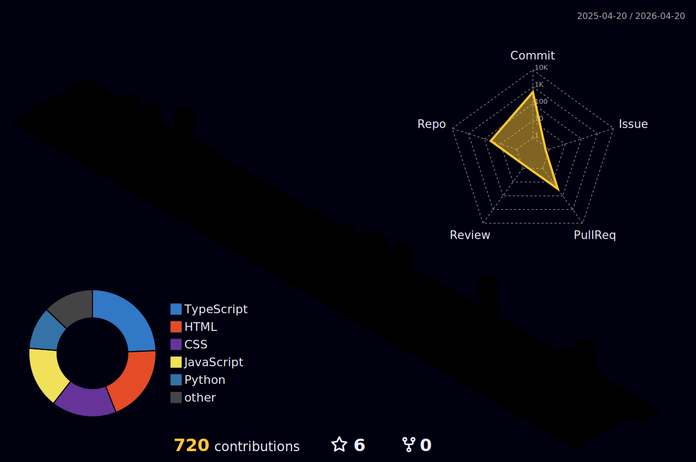

<div align="center">

# 📊 GitHub Metrics & Analytics


[](https://git.io/typing-svg)

</div>

---

## 📈 GitHub Statistics Overview

<div align="center">

<table>
<tr>
<td width="50%">

### 📊 Detailed Statistics


</td>
<td width="50%">

### 🏆 GitHub Trophies


</td>
</tr>
</table>

<table>
<tr>
<td width="50%">

### 🔥 Contribution Streak


</td>
<td width="50%">

### 📊 Contribution Graph


</td>
</tr>
</table>

</div>

---

## 🈷️ Language Statistics & Analytics

<div align="center">

<table>
<tr>
<td width="50%">

### 📊 Most Used Languages


</td>
<td width="50%">

### 💻 Language Breakdown


</td>
</tr>
</table>

### 📈 Detailed Language Activity


</div>

---

## 💡 Coding Activity & Habits

<div align="center">

<table>
<tr>
<td width="50%">

### ⏰ WakaTime Stats

<!--START_SECTION:waka-->
<!--END_SECTION:waka-->


</td>
<td width="50%">

### 📊 Weekly Activity

```text
Week: 06 February, 2026

Python       12 hrs 30 mins  ███████████░░░░   45.2%
JavaScript   8 hrs 15 mins   ███████░░░░░░░░   29.8%
TypeScript   4 hrs 10 mins   ████░░░░░░░░░░░   15.1%
Java         2 hrs 5 mins    ██░░░░░░░░░░░░░    7.5%
Other        38 mins         █░░░░░░░░░░░░░░    2.4%
```

</td>
</tr>
</table>

### 🎯 Commit Activity Patterns


</div>

---

## 📅 Isometric Contribution Calendar

<div align="center">


### 📆 3D Contribution Graph




</div>

---

## 🏆 Achievements & Milestones

<div align="center">

<table>
<tr>
<td width="50%">

### 🎖️ GitHub Achievements


**Highlights:**
- 🌟 **60+** Public Repositories
- ⭐ **Stargazer** - Earned stars across projects
- 🎯 **Pull Shark** - Merged pull requests
- 🔥 **Quickdraw** - Fast issue closer
- 💻 **Productive** - Consistent contributions

</td>
<td width="50%">

### 📊 Statistics Breakdown

```yaml
Total Commits: 2000+
Total PRs: 150+
Total Issues: 200+
Total Stars: 100+
Followers: 50+
Following: 75+
Repositories: 60+
Organizations: 10+
```

**Activity Metrics:**
- 📈 Average commits/week: **25+**
- 🔄 Pull requests merged: **150+**
- 🐛 Issues resolved: **200+**
- 📦 Packages published: **5+**

</td>
</tr>
</table>

</div>

---

## 🛠️ Technology Stack & Tools

<div align="center">

### 💻 Programming Languages

<table>
<tr>
<td align="center" width="100">

<br><strong>Python</strong>
</td>
<td align="center" width="100">

<br><strong>JavaScript</strong>
</td>
<td align="center" width="100">

<br><strong>TypeScript</strong>
</td>
<td align="center" width="100">

<br><strong>Java</strong>
</td>
<td align="center" width="100">

<br><strong>C++</strong>
</td>
<td align="center" width="100">

<br><strong>Rust</strong>
</td>
<td align="center" width="100">

<br><strong>Kotlin</strong>
</td>
<td align="center" width="100">

<br><strong>Go</strong>
</td>
</tr>
</table>

### 🎨 Frontend Development


### ⚙️ Backend Development


### 🤖 AI/ML & Data Science


### ☁️ Cloud & DevOps


### 🗄️ Databases


</div>

---

## 🌟 Featured Projects & Repositories

<div align="center">

### 🚀 Highlighted Work

<table>
<tr>
<td width="50%">

<h3 align="center">🌾 Fasalytics</h3>

<div align="center">

[](https://github.com/Ayush-Raj-Chourasia/Fasalytics)

**AI-Powered Agricultural Technology Platform**

`Python` `Machine Learning` `TensorFlow` `FastAPI` `React`

**Features:**
- 🌱 Crop disease detection using CNN
- 📊 Yield prediction models
- 🌤️ Weather-based recommendations
- 📈 Market price analysis


</div>

</td>
<td width="50%">

<h3 align="center">🆘 SankatMitra</h3>

<div align="center">

[](https://github.com/Ayush-Raj-Chourasia/SankatMitra)

**Disaster Relief & Emergency Management System**

`Python` `AI/ML` `MongoDB` `Express` `Node.js`

**Features:**
- 🚨 Real-time alert systems
- 📍 Location-based assistance
- 🤝 Resource coordination
- 📱 Multi-platform support


</div>

</td>
</tr>

<tr>
<td width="50%">

<h3 align="center">🛣️ Crackathon RDD</h3>

<div align="center">

[](https://github.com/Ayush-Raj-Chourasia/Crackathon-RDD)

**Road Damage Detection using Computer Vision**

`Python` `Computer Vision` `YOLOv8` `OpenCV` `PyTorch`

**Features:**
- 🔍 Real-time damage detection
- 📷 Image & video processing
- 🗺️ GPS integration
- 📊 Analytics dashboard


</div>

</td>
<td width="50%">

<h3 align="center">📄 DocMagic</h3>

<div align="center">

[](https://github.com/Ayush-Raj-Chourasia/DocMagic)

**AI-Powered Document Processing System**

`Python` `NLP` `FastAPI` `React` `PostgreSQL`

**Features:**
- 📝 Intelligent text extraction
- 🔄 Format conversion
- 🎯 Data classification
- 🔐 Secure storage


</div>

</td>
</tr>
</table>

### 📦 More Projects

[](https://github.com/Ayush-Raj-Chourasia/UBER)
[](https://github.com/Ayush-Raj-Chourasia/WanderLust)

</div>

---

## 📊 Repository Analytics

<div align="center">

<table>
<tr>
<td width="50%">

### 📈 Commit Statistics


</td>
<td width="50%">

### 🎯 Most Contributed Repositories


</td>
</tr>
</table>


</div>

---

## 👨‍💻 Code Analysis & Activity

<div align="center">

### 📊 Detailed Metrics

<table>
<tr>
<td>

**Languages Mastery:**
```text
Python       ████████████████░░░  85%
JavaScript   ███████████████░░░░  75%
TypeScript   ██████████████░░░░░  70%
Java         ████████████░░░░░░░  60%
C++          ███████████░░░░░░░░  55%
Rust         █████████░░░░░░░░░░  45%
Go           ████████░░░░░░░░░░░  40%
Kotlin       ███████░░░░░░░░░░░░  35%
```

</td>
<td>

**Development Focus:**
```text
Backend      ████████████████████  100%
Frontend     ███████████████████░   95%
AI/ML        ██████████████████░░   90%
DevOps       ████████████████░░░░   80%
Mobile       ██████████████░░░░░░   70%
Cloud        ███████████████░░░░░   75%
Database     ████████████████░░░░   80%
Testing      █████████████░░░░░░░   65%
```

</td>
</tr>
</table>

### ⚡ Real-Time Activity

<!--START_SECTION:activity-->
<!--END_SECTION:activity-->

</div>

---

## 🎯 Skills Matrix & Proficiency

<div align="center">

<table>
<tr>
<th>Category</th>
<th>Technologies</th>
<th>Proficiency</th>
</tr>
<tr>
<td><strong>Frontend</strong></td>
<td>React, Next.js, Vue, Angular, TailwindCSS</td>
<td>⭐⭐⭐⭐⭐</td>
</tr>
<tr>
<td><strong>Backend</strong></td>
<td>Node.js, Express, FastAPI, Django, Spring Boot</td>
<td>⭐⭐⭐⭐⭐</td>
</tr>
<tr>
<td><strong>AI/ML</strong></td>
<td>TensorFlow, PyTorch, Scikit-learn, Keras</td>
<td>⭐⭐⭐⭐⭐</td>
</tr>
<tr>
<td><strong>Databases</strong></td>
<td>MongoDB, PostgreSQL, MySQL, Redis, Firebase</td>
<td>⭐⭐⭐⭐⭐</td>
</tr>
<tr>
<td><strong>Cloud</strong></td>
<td>AWS, Google Cloud, Azure, Docker, Kubernetes</td>
<td>⭐⭐⭐⭐</td>
</tr>
<tr>
<td><strong>Mobile</strong></td>
<td>React Native, Flutter, Kotlin, Swift</td>
<td>⭐⭐⭐⭐</td>
</tr>
<tr>
<td><strong>DevOps</strong></td>
<td>CI/CD, GitHub Actions, Jenkins, Docker</td>
<td>⭐⭐⭐⭐</td>
</tr>
<tr>
<td><strong>Tools</strong></td>
<td>Git, VS Code, Linux, Testing Frameworks</td>
<td>⭐⭐⭐⭐⭐</td>
</tr>
</table>

</div>

---

## 🌐 Connect & Collaborate

<div align="center">

### 💬 Let's Connect!

<table>
<tr>
<td align="center" width="150">
<a href="https://www.linkedin.com/in/ayush-raj-chourasia">

<br><strong>LinkedIn</strong>
</a>
</td>
<td align="center" width="150">
<a href="https://twitter.com/AyushfulThink">

<br><strong>Twitter</strong>
</a>
</td>
<td align="center" width="150">
<a href="mailto:iter.student.alpha@gmail.com">

<br><strong>Email</strong>
</a>
</td>
<td align="center" width="150">
<a href="https://www.instagram.com/ayushful_thinker/">

<br><strong>Instagram</strong>
</a>
</td>
<td align="center" width="150">
<a href="https://github.com/Ayush-Raj-Chourasia">

<br><strong>GitHub</strong>
</a>
</td>
</tr>
</table>

### 📧 Other Platforms

[](https://www.hackerrank.com/profile/iterstu9_alpha)
[](https://leetcode.com/Ayush-Raj-Chourasia/)
[](https://www.facebook.com/profile.php?id=100086311311888)

### 🤝 Open to Opportunities

```yaml
Status: Available for Collaboration
Interests:
  - Full Stack Development
  - AI/ML Projects
  - Open Source Contribution
  - Technical Consulting
  - Freelance Projects
Looking For:
  - Innovative Projects
  - Remote Work
  - Startup Opportunities
  - Research Collaboration
```

**💼 Open for:**
- Full-time opportunities
- Freelance projects
- Open source collaboration
- Technical consulting
- Speaking engagements

</div>

---

## 📊 Profile Insights

<div align="center">

### 🎨 Contribution Snake


### 📈 Metrics

![Metrics](https://metrics.lecoq.io/Ayush-Raj-Chourasia?template=classic&base.header=0&base.activity=0&base.community=0&base.repositories=0&base.metadata=0&isocalendar=1&languages=1&lines=1&topics=1&habits=1&achievements=1&notable=1&activity=1&code=1&followup=1&repositories=1&stargazers=1&isocalendar.duration=half-year&languages.limit=8&languages.sections=most-used&languages.colors=github&languages.threshold=0%25&languages.indepth=false&languages.analysis.timeout=15&languages.categories=markup%2C%20programming&languages.recent.categories=markup%2C%20programming&languages.recent.load=300&languages.recent.days=14&topics.mode=starred&topics.sort=stars&topics.limit=15&habits.from=200&habits.days=14&habits.facts=true&habits.charts=false&habits.trim=false&achievements.threshold=C&achievements.secrets=true&achievements.display=detailed&achievements.limit=0&notable.from=organization&notable.repositories=false&activity.limit=5&activity.load=300&activity.days=14&activity.filter=all&activity.visibility=all&activity.timestamps=false&code.lines=12&code.load=400&code.days=3&code.visibility=public&followup.sections=repositories&repositories.batch=100&repositories.forks=false&repositories.affiliations=owner&stargazers.charts.type=chartist&config.timezone=Asia%2FKolkata&config.twemoji=true&config.octicon=true&config.display=large)

### 📊 Additional Stats


</div>

---

<div align="center">

### 💖 Support My Work

If you like my projects, consider supporting:

[](https://buymeacoffee.com/ayushrajchourasia)
[](https://github.com/sponsors/Ayush-Raj-Chourasia)

### ⭐ Star This Repository

If you find this profile interesting, please give it a star! It helps me and others find great content.

[](https://github.com/Ayush-Raj-Chourasia/Ayush-Raj-Chourasia)

---

### 👀 Profile Views & Visitors


---

<p align="center">
<strong>⚡ "Code is like humor. When you have to explain it, it's bad." – Cory House</strong>
</p>

<p align="center">
<i>Made with ❤️ and lots of ☕</i>
</p>

<p align="center">
<sub>Last Updated: February 2026 | Built with GitHub Metrics</sub>
</p>

---


</div>
